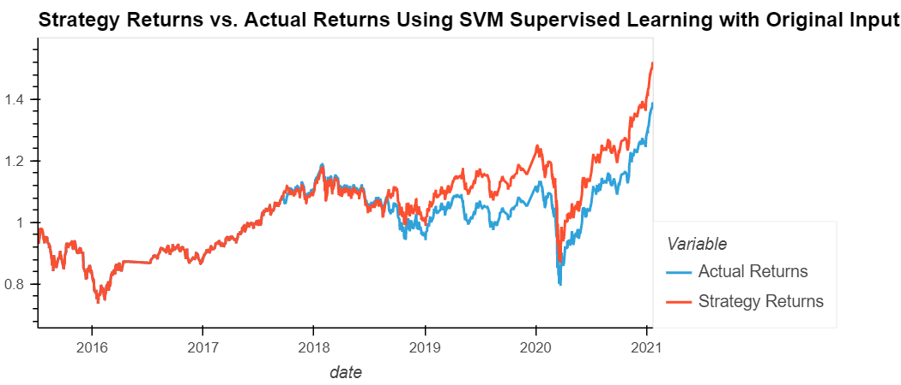
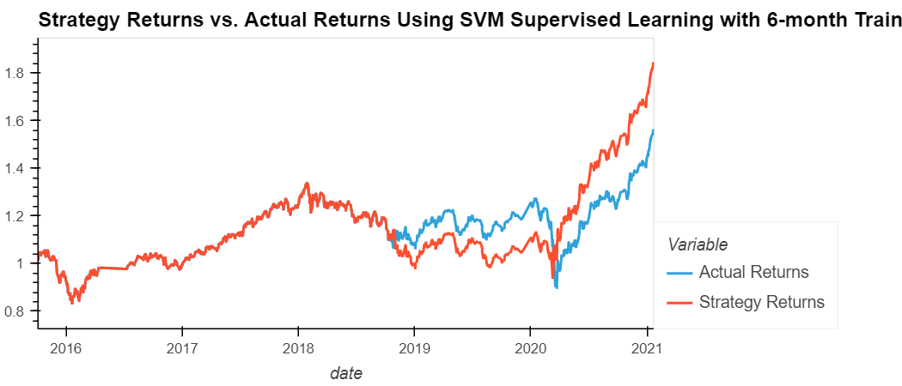
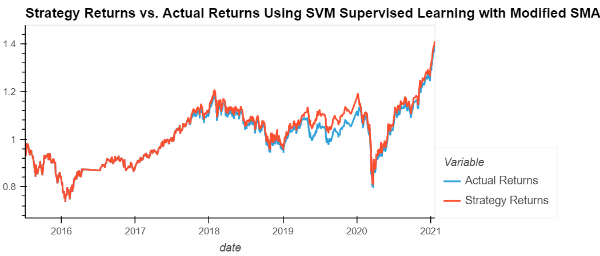
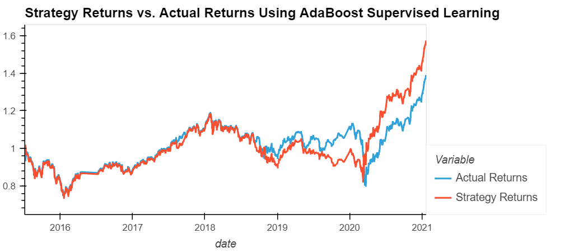

# Module 14 Challenge - Machine Learning Trading Bot

## Description

In this excercise, we are assume the role of a financial advisor planning to improve on an existing algorithmic trading system to maintain the firms competitive advantage in regards to the rest of the market.  We do this by evaluating evaluating and modifying existing trading signals as well as implementing different machine learning algorithms.

This notebook is divided into three sections plus a Conclusion section in this `README.md` file:

* Establish Baseline Performance 
    * Run the provided starter code to establish a baseline performance for the trading algorithm.

* Tune the Baseline Trading Algorithm 
    * Tune, or adjust, the model’s input features to find the parameters that result in the best trading outcomes. 

* Evaluate a New Machine Learning Classifier
    * Use the original parameters that the starter code provided. Apply them to the performance of a second machine learning model.

* Evaluation Report
    * Evaluate and discuss the results of this excercise.  Located in the following section of this `README.md`.  

---

# Evaluation Report 

The following sections outline and discuss the performance for each step in the notebook:

## Establish a Baseline Performance

### Baseline Performance



The baseline performance of the model has an accuracy at around 0.55 and return of about 48%.  The baseline performance uses a SVC classifier model and generates signals using crossing SMA values with a SMA short window of 4-days and a SMA long window of 100-days.  The baseline training data is 3-months from the beginning the dataset. 

## Tune the Baseline Trading Algorithm

### Modified Training Window Performance (Increased Training Window to 6-months)



Increasing the trained dataset to be 6-months rather than 3-months, we have increased the accuracy and return when compared to the baseline model.  The new performance with the modified training window has an accuracy at around 0.56 and return of about 84%.

* Increasing the training window improved our model accuracy slightly and improve our cumulative returns significantly.
* Decreasing the training window did not seem to have any effect on the model accuracy or cumulative returns when compared to the oringinal data. 

### Modified SMA Window Performance (Decrease SMA Short Window to 2-days)



Decreasing the SMA short window to be 2-days rather than 4-days, we have increased the accuracy but decreased the return compared to the baseline model.  The new performance with the modified SMA short window has an accuracy at around 0.56 and return of about 41%.

* Decreasing the short SMA window made it so there was no significant improvement from actual returns.  Decreasing this window seems to have decreased the amount of buying and     selling signals. 
* Decreasing the long SMA window made it so there was no significant improvement from actual returns.  Decreasing this window seems to have decreased the amount of buying and selling signals. 
* Increasing the short SMA window made it so there were no buying or selling signals so we stay with the original position and follow actual returns.  
* Increasing the long SMA window decreased the number of buying and selling signals but in this case, we underperform the actual returns. 

Modifying the SMA was discovered to be tricky becuase if you adjust one too much, it can eliminate any trading signals becuase the conditions remain the same through the timeframe of the data so you end up just following actual returns.  

### Parameters that Optimize the Original Model

I found that increasing the training data set from 3-months to 6-months, while maintaining the existing SMA windows had the biggest increase on returns when using the original SVC classifier model.  After adjusting the input parameters, the new returns were around 84% compared to the 48% with the original input parameters.  


## Evaluate a New Machine Learning Classifier

In this section, we imported a new classifier to utilize for a second machine learning model and compare results with the original.  All input parameters for this section will be the same as the original. 

The classifer used for the second machine learning model is called AdaBoost. 

* [AdaBoost](https://scikit-learn.org/stable/modules/generated/sklearn.ensemble.AdaBoostClassifier.html) - An AdaBoost classifier is a meta-estimator that begins by fitting a classifier on the original dataset and then fits additional copies of the classifier on the same dataset but where the weights of incorrectly classified instances are adjusted such that subsequent classifiers focus more on difficult cases.

The results for the new classifier are as follows: 




The new machine learning model has the same accuracy as the original model but has an increased return.  The accuracy of the new model is around 0.55 and the return is around 57%.  The 57% return is significant compared to the 48% return from the original model, which indicates that this new model may be better to utilize moving forward.  This is also using the original 3-month training period so there may be even more chance to improve this model by increasing this input parameter.  

---

## Technologies

This project leverages JupyterLab Version 3.0.14 in association with Anaconda distribution and the Conda package manager.  The following packages are also used: 

* [pandas](https://github.com/pandas-dev/pandas) - Data analysis toolkit for Python.

* [sklearn](https://scikit-learn.org/stable/) - Predictive data analysis.

* [numpy](https://github.com/numpy/numpy) - Fundamental package for scientific computing with Python.

---

## Installation Guide

Before running the application, install Python modules Pandas, hvPlot and sklearn:

```python

  conda install pandas

  conda install numpy

  pip install -U scikit-learn

```
---

## Contributors

Joshua Creveling

Email: josh.creveling22@gmail.com

GitHub: https://github.com/joshuacreveling

LinkedIn: https://www.linkedin.com/in/joshua-creveling/

*Starter template provided by Trilogy Education Services*

---

## License

MIT
